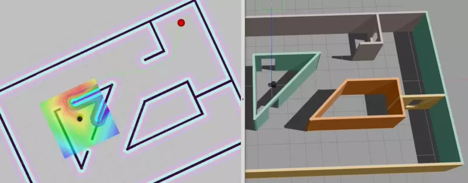
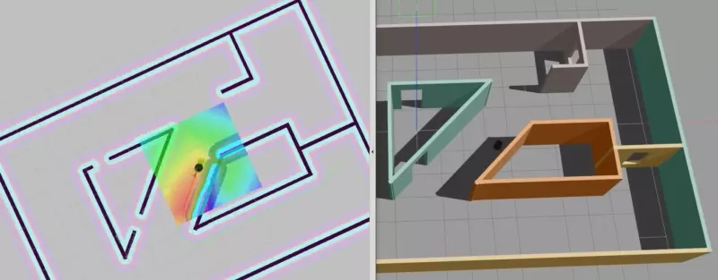

# Home Service Robot

The goal of this project is to bring together a couple of ROS/RViz/Gazebo concepts:

- World and odometry simulation in Gazebo,
- Visualization of the odometry, sensor and localization data, as well as virtual objects in RViz,
- SLAM via gmapping, and
- Adaptive Monte-Carle Localization via the AMCL package.



The robot in this scenario is tasked with picking up a virtual item from a start position,
visualized by a red sphere in RViz, in order to bring to to a goal position. Navigation to the start and
end positions is implemented in [`/pick_objects_node.cpp`](src/pick_objects/src/pick_objects_node.cpp), and
visualization of the item is implemented in [`add_markers_node.cpp`](src/add_markers/src/add_markers_node.cpp).



Note that in both cases, the start and goal positions are provided statically, and the whole
implementation can be (drastically) improved by publishing pick-up and drop-off locations via a dedicated topic.

---

To build the project, you can try executing `./run-nvidia.sh` to drop
into an X11 aware Docker container with NVIDIA GPU support.

To run the code, execute either one of these scripts; each of them will spin up all nodes required
for the individual test task at hand: 

- [`src/scripts/test_slam.sh`](src/scripts/test_slam.sh)
- [`src/scripts/test_navigation.sh`](src/scripts/test_navigation.sh)
- [`src/scripts/pick_objects.sh`](src/scripts/pick_objects.sh)

## Docker environment

An issue exists with ROS Kinetic and TurtleBot in Docker, since the TurtleBot packages rely on
`librealsense`, which in turn depends on a Kernel module that cannot be installed. This is pointed out by
[IntelRealSense/librealsense#4781](https://github.com/IntelRealSense/librealsense/issues/4781), which
(thankfully) also provides a workaround. That workaround is implemented in [`docker/build-librealsense.sh`](docker/build-librealsense.sh) and is executed as part of the Docker image build in [`build-docker.sh`](build-docker.sh).

## Building with CLion IDE

**Note:** This does not _really_ work, as CLion will be unable to find generated headers. It's still a bit
          better than doing everything the hard way.

The full requirements for setting up CLion are given in the [sunsided/robond-ros-docker](https://github.com/sunsided/robond-ros-docker)
repository. In short, run SSHD in Docker, configure a Remote Host build to connect to it, then configure
the your build settings for ROS. For this repo and the included Dockerfile, this configuration will do:

**CMake options:**

```
-DCATKIN_DEVEL_PREFIX:PATH=/workspace/devel -DCMAKE_PREFIX_PATH=/workspace/devel;/opt/ros/kinetic;/opt/ros/kinetic/share
```

**Environment:**

```
ROS_ROOT=/opt/ros/kinetic/share/ros;ROS_PACKAGE_PATH=/workspace/src:/opt/ros/kinetic/share;ROS_MASTER_URI=http://localhost:11311;ROS_PYTHON_VERSION=2;ROS_VERSION=1;ROSLISP_PACKAGE_DIRECTORIES=/workspace/devel/share/common-lisp;ROS_DISTRO=kinetic;ROS_ETC_DIR=/opt/ros/kinetic/etc/ros;PYTHONPATH=/opt/ros/kinetic/lib/python2.7/dist-packages;PKG_CONFIG_PATH=/workspace/devel/lib/pkgconfig:/opt/ros/kinetic/lib/pkgconfig:/opt/ros/kinetic/lib/x86_64-linux-gnu/pkgconfig;LD_LIBRARY_PATH=/workspace/devel/lib:/opt/ros/kinetic/lib:/opt/ros/kinetic/lib/x86_64-linux-gnu:$LD_LIBRARY_PATH;PATH=/opt/ros/kinetic/bin:$PATH
```
